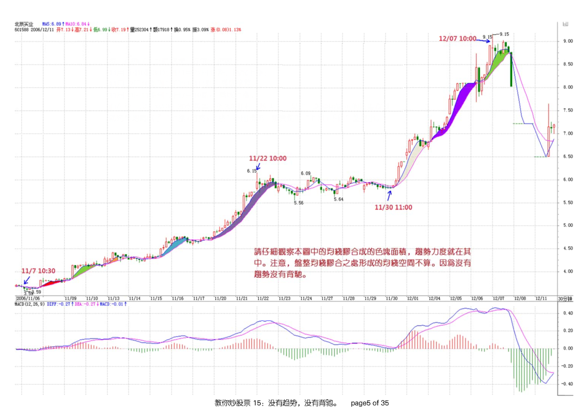
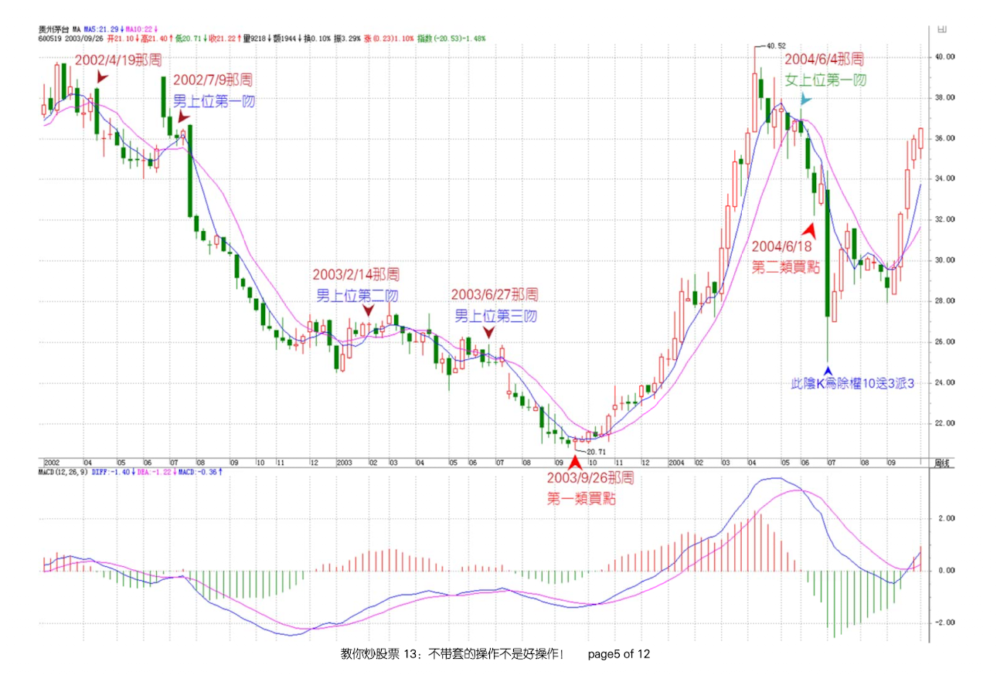

# 均线系统

---

## 概念
- 女上位和男上位
- 缠绕（是中继，还是转折）
  - 飞吻：短期均线略略走平后继续按原来趋势进行下去。
  - 唇吻：短期均线靠近长期均线但不跌破或升破，然后按原来趋势继续下去。
  - 湿吻：短期均线跌破或升破长期均线甚至出现反复缠绕，如胶似漆。
- 缠中说禅趋势力度（用来判断背驰）
  前一“吻”的结束与后一“吻”开始由短线均线与长期均线相交所形成的面积。在前后两个同向趋势中，当缠中说禅趋势力度比上一次缠中说禅趋势力度要弱，就形成“背驰”。  
    
  `缠中说禅趋势平均力度`:当下价格走势与前一“吻”的结束时，这段区间内短线均线与长期均线形成的面积除以时间。   
  这个概念是即时的，马上就可以判断当下的缠中说禅趋势平均力度与前一次平均力度的强弱对比，一旦这次比上次弱，就可以判断“背驰”即将形成，然后再根据短线均线与长期均线的距离，一旦延伸长度缩短，就意味着真正的底部马上形成。  

### 做多的买点
`第一买点`：
- 处于男上位趋势中  
- 最后一次缠绕（非第一次）后出现转折的情况 —— 急跌+背驰  

`第二买点`：
- 最近刚从男上位趋势转折，转换成了女上位  
- 处于那女上位的第一次缠绕后的下跌 —— 次级别的第一类买点  
- 出现第一次缠绕前，5日线的走势必须是十分有力的（不能疲软）
  这样缠绕极大可能是中继，其后至少会有一次上升的过程出现
- 缠绕出现前的成交量不能放得过大  
  一旦过大，骗线出现的几率就会大大增加，如果量突然放太大而又萎缩过快，一般即使没有骗线，缠绕的时间也会增加，而且成交量也会现在两次收缩的情况

`MACD辅助`：第一买点都是黄白线在 0 轴线之下背驰形成的，第二买点都是黄白线第一次上 0 轴线后回抽后确认而形成的。

### 做多的卖点
`第一卖点`：
- 处于女上位趋势中
- 缠绕后出现背驰
  
`第二卖点`：
- 最近刚从女上位趋势转折，转换成了男上位  
- 男上位的第一个缠绕中的高点

### 操作策略
在第二买点买，第一卖点卖。
如果对背驰把握到位，可以在第一买点买。   