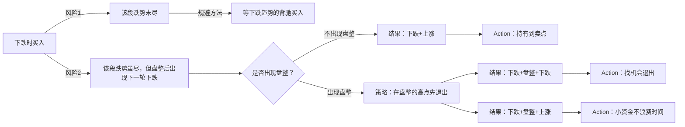
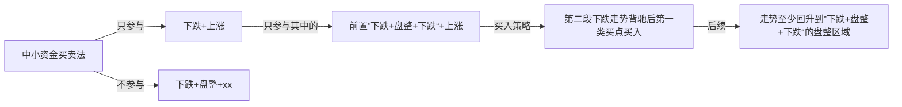

# 10-中小资金买卖法

***

## 1. 走势组合
(《教你炒股票16 中小资金的高效买卖法》)

基本走势分为上涨、下跌、盘整三种，有六种组合可能代表着三类不同的走势：

* 陷阱式：上涨+下跌；下跌+上涨。  
* 反转式：上涨+盘整+下跌；下跌+盘整+上涨。
* 中继式：上涨+盘整+上涨；下跌+盘整+下跌。

对于多头，有买入价值的组合是：

* 下跌+上涨
* 下跌+盘整+上涨
* 上涨+盘整+上涨

没有买入价值的是：

* 上涨+下跌
* 上涨+盘整+下跌
* 下跌+盘整+下跌

因此，在一个下跌走势中买入，其后只会遇到一种没买入价值的走势。

## 2. 目标
适合大资金买入的走势组合：下跌+盘整+上涨。
适合中小资金的买入走势组合只有：**下跌+上涨**。

对于“下跌+上涨“，连接前面”下跌“的可能走势有两种：上涨和盘整。
- 如果前面的走势是上涨，那么在高级别的走势中，会是一个盘整。而中小资金最好不参与盘整。
- 如果前面是盘整，在前面只能是上涨或者下跌。
  - ”上涨+盘整“+下跌+上涨，那么前面的”上涨+盘整+下跌“在高级别也是一个盘整，不适合参与。
  - ”下跌+盘整“+下跌+上涨，那么前面就是”下跌+盘整+下跌“，以此为查找类型组合，在第一买点出现时买入。

综上所述，对于”下跌+上涨“的买卖方法来说，对股票的选择只有一种情况：出现第一类买点、且之前的走势是”下跌+盘整+下跌“。

## 3. 第3类买点高效买卖法
（《教你炒股票32 走势的当下与投资者的思维方式》）
> 一个30分钟的 a+A+b+B+c 的向上走势，你不可能在 A 走出来后就说一定有 B，这样等于是在预测，等于假设一种神秘的力量在确保B的必然存在，而这是不可能的。
> 如果 b 段一个“5 分钟级别的开始上涨”已经使得 30 分钟的图表中不可能出现背驰的情况，那么你就可以有足够的时间去等待走势的延伸，等待他形成一个 5 分钟的中枢，一直到5分钟的走势出现背驰，这样就意味着 B 要出现了，一个 30 分钟的新中枢要出现了。
> 是否走，这和你的资金操作有关了，如果你喜欢短线，你可以走一点，等这个中枢的第一段出现后，回补，第二段高点看 5 分钟或 1 分钟的背弛出去，第三段下来再回补，然后就看这个中枢能否继续向上突破走出 c 段。
> 注意，c 段并不是天经地义一定要有的，就像 a 也不是天经地义一定要有的。“要出现 c 段，如同要出现 b 段，都必须有一个针对 30 分钟的第三类买点出现，这样才会有。”
> 所以，你的操作就很简单了，每次，5 分钟的向上离开中枢后，一旦背驰，就要出来，然后如果一个 5 分钟级别的回拉不回到中枢里，就意味着有第三类买点，那就要回补，等待 c 段的向上。而c段和 b 段的操作是一样的，是否要走，完全可以按当下的走势来判断，无须任何的预测。不背驰，就意味着还有第三个中枢出现，如此类推。显然，上面的操作，不需要你去预测什么，只要你能感应到走势当下的节奏，而这种感应也没有任何的神秘，就是会按定义去看而已。
> 
> 那么，30分钟的 a+A+b+B+c 里，这里的 B 一定是 A 的级别？假设这个问题，同样是不理解走势的当下性。当a+A+b时，你是不可能知道B的级别的，只是，只要 b 不背驰，那 B 至少和 A 同级别，但 B 完全有可能比 A 的级别大，那这时候，就不能说 a+A+b+B+c 就是某级别的上涨了，而是 a+A+b 成为一个$a^{`}$，成为$a^{`}+B$的意义了。
> 但，无论是何种意义，在当下的操作中都没有任何困难，例如，当B扩展成日线中枢，那么就要在日线图上探究其操作的意义，其后如果有c段，那么就用日线的标准来看其背驰，这一切都是当下的。