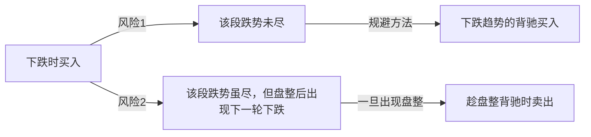

# 10-中小资金买卖法

***

### 1. 走势组合

基本走势分为上涨、下跌、盘整三种，有六种组合可能代表着三类不同的走势：

* &#x20;陷阱式：上涨+下跌；下跌+上涨。&#x20;
* 反转式：上涨+盘整+下跌；下跌+盘整+上涨。
* &#x20;中继式：上涨+盘整+上涨；下跌+盘整+下跌。

对于多头，有买入价值的组合是：

* 下跌+上涨
* 下跌+盘整+上涨
* 上涨+盘整+上涨

没有买入价值的是：

* 上涨+下跌
* 上涨+盘整+下跌
* 下跌+盘整+下跌

