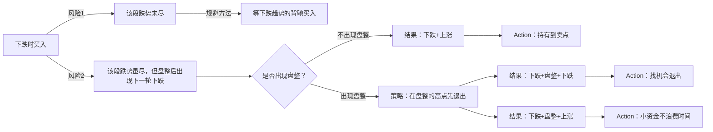
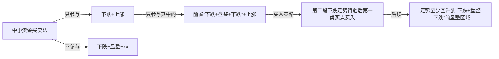

# 10-中小资金买卖法

***

## 1. 走势组合

基本走势分为上涨、下跌、盘整三种，有六种组合可能代表着三类不同的走势：

* 陷阱式：上涨+下跌；下跌+上涨。  
* 反转式：上涨+盘整+下跌；下跌+盘整+上涨。
* 中继式：上涨+盘整+上涨；下跌+盘整+下跌。

对于多头，有买入价值的组合是：

* 下跌+上涨
* 下跌+盘整+上涨
* 上涨+盘整+上涨

没有买入价值的是：

* 上涨+下跌
* 上涨+盘整+下跌
* 下跌+盘整+下跌

因此，在一个下跌走势中买入，其后只会遇到一种没买入价值的走势。

## 2. 目标
适合大资金买入的走势组合：下跌+盘整+上涨。
适合中小资金的买入走势组合只有：**下跌+上涨**。

对于“下跌+上涨“，连接前面”下跌“的可能走势有两种：上涨和盘整。
- 如果前面的走势是上涨，那么在高级别的走势中，会是一个盘整。而中小资金最好不参与盘整。
- 如果前面是盘整，在前面只能是上涨或者下跌。
  - ”上涨+盘整“+下跌+上涨，那么前面的”上涨+盘整+下跌“在高级别也是一个盘整，不适合参与。
  - ”下跌+盘整“+下跌+上涨，那么前面就是”下跌+盘整+下跌“，以此为查找类型组合，在第一买点出现时买入。

综上所述，对于”下跌+上涨“的买卖方法来说，对股票的选择只有一种情况：出现第一类买点、且之前的走势是”下跌+盘整+下跌“。

