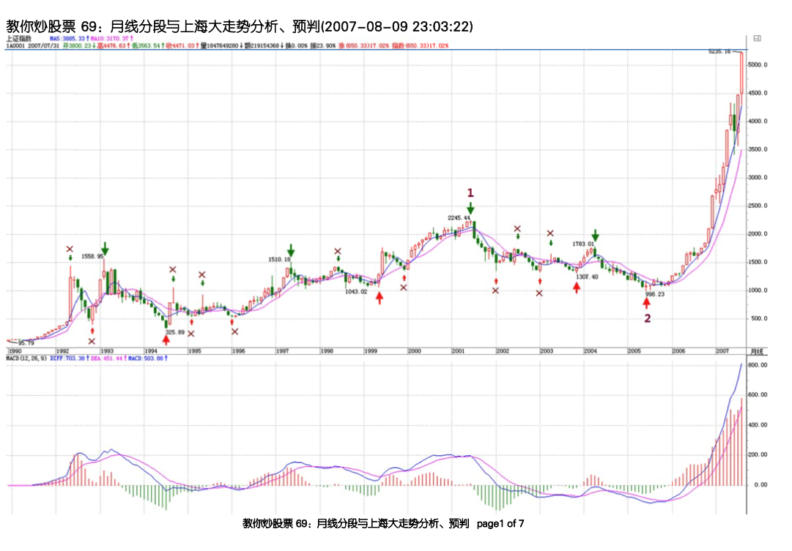

# 笔
笔，是缠论中”最低分析级别“中的最小的分析单元。

---

## 1. 笔的定义
- 要确认笔，首先必须从 K 线中找到至少一个顶分型和一个底分型。
- 连接一对顶、底分型，是一笔的基本条件。
- 顶分型和底分型之间，至少存在一根独立的 K 线。该 K 线既不属于顶分型，也不属于底分型。
    如果顶底之间跳空，可以认为缺口是一根最低级别的 K 线。
- 顶分型的顶值、底分型的底值，必须是笔的最高值和最低值。(ref.《教你炒股票 71：线段分的再分辨》2007-08-16答疑部分)
> 2007-08-16 15:58:06：一是否有类线段那样三角走？说，一之中的、 线是否允许出的？是否一定为一的最高点最点？
> 缠中说禅：
> 一，是一一，怎么会有三角？，然一定是那一的最高最，如果不是，那里面一定不只一。
- 顶分型最高的那根 K 线的价格区间，必须有部分高于底分型那根 K 线的价格区间。底分型亦相同。（ref. 《教你炒股票 77：一些概念的再分辨》）
> 笔，必须是一顶一底，而且顶和底之间至少有一个 K 线不属于顶分型与底分型。
> 当然，还有一个最显然的，就是在同一笔中，顶分型中最高那K线的区间至少要有一部分高于底分型中最低那K线的区间，如果这条都不满足，也就是顶都在低的范围内或顶比底还低，这显然是不可接受的。

## 2. 笔两端分型的分辨
如果存在两个连续的顶或底，处理原则：（ref.《教你炒股票65 再说说分型、笔、线段》）
- 在两个顶或底中间有其他的顶和底，这种情况，只是把好几笔当成了一笔，所以只要继续用一顶一底的原则，自然可以解决。
- 在两个顶或底中间没有其他的顶和底，这种情况，意味着第一个顶或底后的转折级别太小，不足以构成值得考察的对象，这种情况下，第一个的顶或底就可以忽略其存在了，可以忽略不算了。

## 3. 综合示例

绿箭头指着的是顶分型，红箭头的是底分型。打“X”的就是该分型不符合笔所要求分型的规范。