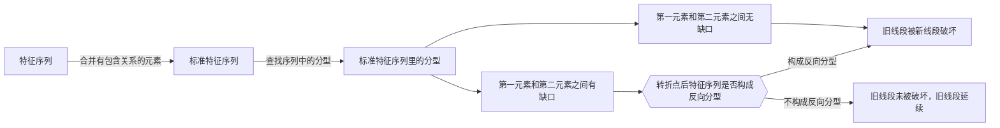

# 线段
线段，在”最低分析级别“，由笔连接而成。

---

## 1. 线段的定义
- 线段，最少由连续的三根笔组成。
- 线段开始的前三笔，必须有重合，开始三笔没有重合的，是构不成线段的。（就只能算旧线段的一部分）
- 向上线段，始于向上笔，也终结于向上笔；向下线段，始于向下笔，也终结于向下笔。

## 2. 线段的划分
### 2.1 从笔破坏的角度（《教你炒股票65 再说说分型、笔、线段》）
对于从向上一笔开始的线段，其中的分型构成这样的序列：$$d_{1}$$、$$g_{1}$$、$$d_2$$、$$g_2$$、$$d_3$$、$$g_3$$…$$d_n$$、$$g_n$$（其中$$d_i$$代表第 i 个底，$$g_i$$代表第 i 个顶）。如果找到 i 和 j，j>=i+2（注意是“大于”等于）,使得 $$d_j$$<=$$g_i$$，那么称向上线段被笔破坏。  
向下一笔开始的线段，类似。
  

**缠中说禅线段分解定理**：线段被破坏，当且仅当至少被“有重叠部分的连续三笔的其中一笔破坏”。而只要构成有重叠部分的前三笔，那么必然会形成一线段，换言之，线段破坏的充要条件，就是被另一个线段破坏。  
`注：该条件在后续原文中被调整为不充分条件 —— 当标准特征序列第一元素和第二元素存在缺口的情况下，被有重叠的连续三笔的一笔破坏，并不能直接判断出旧线段被破坏。`

### 2.2 从特征序列的角度（《教你炒股票67 线段的划分标准》和《教你炒股票71 线段划分标准的再分辨》）
使用特征序列的角度，来表示线段：  
用 S 代表向上的笔，X 代表向下的笔。那么所有的线段，无非两种：(1) 从向上笔开始；(2) 从向下笔开始。  
**以向上笔开始的线段为例**，可以用笔的序列表示：$$S_1X_1S_2X_2S_3X_3$$…$$S_nX_n$$。  
容易证明，任何$$S_i$$与$$S_{i+1}$$之间，一定有重合区间。而考察序列$$X_1X_2$$…$$X_n$$，该序列中，$$X_i$$与$$X_{i+1}$$之间并不一定有重合区间，因此，这序列更能代表线段的性质。  
定义：
- 序列$$X_1X_2$$…$$X_n$$成为以向上笔开始线段的特征序列；
- 序列$$S_1S_2$$…$$S_n$$成为以向下笔开始线段的特征序列。
- 特征序列两相邻元素间没有重合区间，称为该序列的一个缺口。

**`标准特征序列`**：关于特征序列，把每一元素看成是一 K 线，那么，如同一般 K 线图中找分型的方法，也存在所谓的包含关系，也可以对此进行非包含处理。经过非包含处理的特征序列，成为标准特征序列。
注意，特征序列的元素包含关系，首先的前提是这元素都在一特征序列里，如果两个不同的特征序列之间的元素，讨论包含关系是没意义的。

缠论原文一共有”两种划分思路“的路径入口:
- `先在标准特征序列里面查找分型`（《教你炒股票67 线段的划分标准》）
  > 在标准特征序列里，构成分型的三个相邻元素，只有两种可能：  
  > 第一种情况：  
  > 特征序列的顶分型中，第一和第二元素间不存在特征序列的缺口，那么该线段在该顶分型的高点处结束，该高点是该线段的终点；特征序列的底分型中，第一和第二元素间不存在特征序列的缺口，那么该线段在该底分型的低点处结束，该低点是该线段的终点；  
  >
  > 第二种情况：  
  > 特征序列的顶分型中，第一和第二元素间存在特征序列的缺口，如果从该分型最高点开始的向下一笔开始的序列的特征序列出现底分型，那么该线段在该顶分型的高点处结束，该高点是该线段的终点；特征序列的底分型中，第一和第二元素间存在特征序列的缺口，如果从该分型最低点开始的向上一笔开始的序列的特征序列出现顶分型，那么该线段在该底分型的低点处结束，该低点是该线段的终点。  
  >
  > 强调，在第二种情况下，后一特征序列不一定封闭前一特征序列相应的缺口，而且，第二个序列中的分型，不分第一二种情况，只要有分型就可以。  
  > 上面两种情况，就给出所有线段划分的标准。显然，出现特征序列的分型，是线段结束的前提条件。  
- `先查找线段被转折点后的第一笔破坏`（《教你炒股票71 线段划分标准的再分辨》）
  > 从转折点开始，如果第一笔就破坏了前线段，进而该笔延伸出三笔来，其中第三笔破点第一笔的结束位置，那么，新的线段一定形成，前线段一定结束。  
  > 这种情况还有更复杂一点的情况，就是第三笔完全在第一笔的范围内，这样，这三笔就分不出是向上还是向下，这样也就定义不了什么特征序列。为什么？因为特征序列是和走势相反的，而走势连方向都没有，那怎么知道哪个元素属于特征序列？这种情况，无非两种最后的结果：  
  > - (1)最终还是先破了第一笔的结束位置，这时候，新的线段显然成立，旧线段还是被破坏了；  
  > - (2)最终，先破第一笔的开始位置，这样旧线段只被一笔破坏，接着就延续原来的方向，那么，显然旧线段依然延续，新线段没有出现。  

如果按照第一条路径的思路，在查找分型的时候，就会自动排除掉 —— 第二条路径里的”更复杂一点的情况“中的”最终先破第一笔的开始位置“。因为按照顶分型是 ”高点最高“ and ”低点最高“（底分型是 ”低点最低“ and ”高点最低“），因此推断 71 课仅仅是对特征元素包含等复杂情况的解释说明。  

所以，总结来说的话，用图表示划分步骤：

**出现特征序列的分型，是线段结束的前提条件。**
## 3. 综合示例

图中每种走势中的每一划都代表实际走势中的一笔，请问，里面构成一段线段走势的有多少种？ (ref. 《65课后附录：出题，有空的都请进来》)
