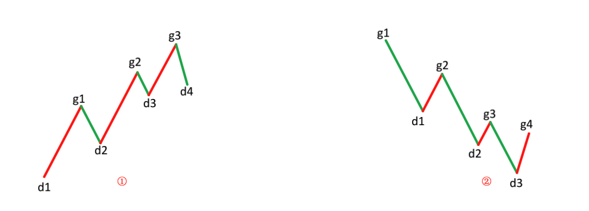
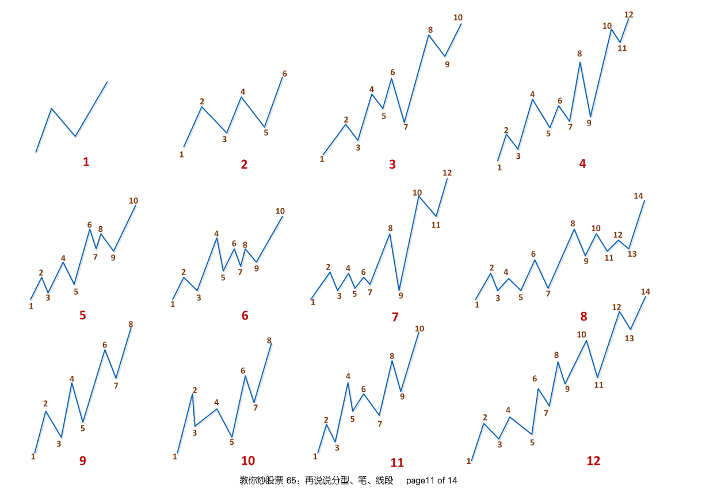

# 线段
线段，在”最低分析级别“，由笔连接而成。

---

## 1. 线段的定义
- 线段，最少由连续的三根笔组成。
- 线段开始的前三笔，必须有重合，开始三笔没有重合的，是构不成线段的。（就只能算旧线段的一部分）
- 向上线段，始于向上笔，也终结于向上笔；向下线段，始于向下笔，也终结于向下笔。

## 2. 线段的划分
### 2.1 从笔破坏的角度
对于从向上一笔开始的线段，其中的分型构成这样的序列：$$d_{1}$$、$$g_{1}$$、$$d_2$$、$$g_2$$、$$d_3$$、$$g_3$$…$$d_n$$、$$g_n$$（其中$$d_i$$代表第 i 个底，$$g_i$$代表第 i 个顶）。如果找到 i 和 j，j>=i+2（注意是“大于”等于）,使得 $$d_j$$<=$$g_i$$，那么称向上线段被笔破坏。  
向下一笔开始的线段，类似。
  

**缠中说禅线段分解定理**：线段被破坏，当且仅当至少被“有重叠部分的连续三笔的其中一笔破坏”。而只要构成有重叠部分的前三笔，那么必然会形成一线段，换言之，线段破坏的充要条件，就是被另一个线段破坏。  

### 2.2 从特征序列的角度
使用特征序列的角度，来表示线段：  
用 S 代表向上的笔，X 代表向下的笔。那么所有的线段，无非两种：(1) 从向上笔开始；(2) 从向下笔开始。  
**以向上笔开始的线段为例**，可以用笔的序列表示：$$S_1X_1S_2X_2S_3X_3$$…$$S_nX_n$$。  
容易证明，任何$$S_i$$与$$S_{i+1}$$之间，一定有重合区间。而考察序列$$X_1X_2$$…$$X_n$$，该序列中，$$X_i$$与$$X_{i+1}$$之间并不一定有重合区间，因此，这序列更能代表线段的性质。  
定义：
- 序列$$X_1X_2$$…$$X_n$$成为以向上笔开始线段的特征序列；
- 序列$$S_1S_2$$…$$S_n$$成为以向下笔开始线段的特征序列。
- 特征序列两相邻元素间没有重合区间，称为该序列的一个缺口。

划分：

graph LR
  A[特征序列] --|合并有包含关系的元素|--> B[标准特征序列] --|查找序列中的分型|--> C[标注特征序列里的分型]
  C --> C1[第一元素和第二元素之间无缺口] & C2[第一元素和第二元素之间无缺口] --> D[线段是否被线段破坏] --> E[线段是否完成]


## 3. 综合示例

图中每种走势中的每一划都代表实际走势中的一笔，请问，里面构成一段线段走势的有多少种？ (ref. 《65课后附录：出题，有空的都请进来》)
