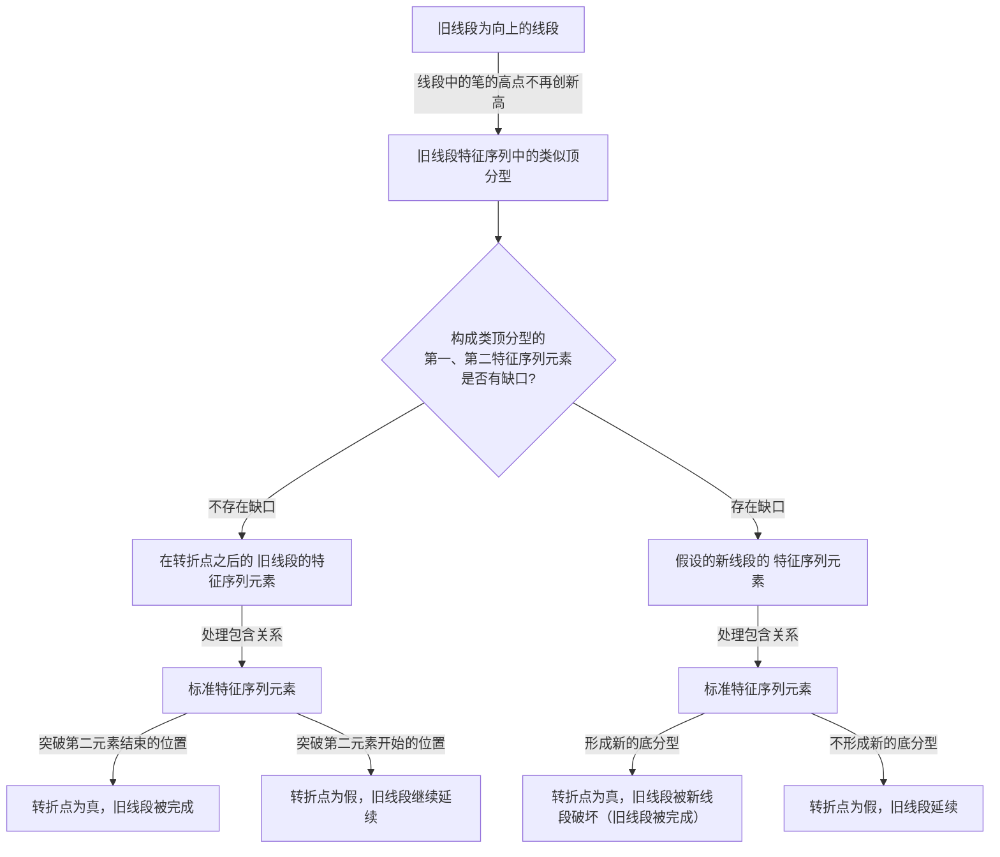

# 4-线段

线段，在”最低分析级别“，由笔连接而成。

***

## 1. 线段的定义

* 线段，最少由连续的三根笔组成。
* 线段开始的前三笔，必须有重合，开始三笔没有重合的，是构不成线段的。（就只能算旧线段的一部分）
* 向上线段，始于向上笔，也终结于向上笔；向下线段，始于向下笔，也终结于向下笔。

## 2. 线段的划分

### 2.1 关键概念

#### 线段被笔破坏（《教你炒股票65 再说说分型、笔、线段》）

对于从向上一笔开始的线段，其中的分型构成这样的序列：$$d_{1}$$、$$g_{1}$$、$$d_2$$、$$g_2$$、$$d_3$$、$$g_3$$…$$d_n$$、$$g_n$$（其中$$d_i$$代表第 i 个底，$$g_i$$代表第 i 个顶）。如果找到 i 和 j，j>=i+2（注意是“大于”等于）,使得 $$d_j$$<=$$g_i$$，那么称向上线段**被笔破坏**。\
向下一笔开始的线段，类似。

&#x20;

#### 特征序列（《教你炒股票67 线段的划分标准》和《教你炒股票71 线段划分标准的再分辨》）

使用特征序列的角度，来表示线段：\
用 S 代表向上的笔，X 代表向下的笔。那么所有的线段，无非两种：(1) 从向上笔开始；(2) 从向下笔开始。\
**以向上笔开始的线段为例**，可以用笔的序列表示：$$S_1X_1S_2X_2S_3X_3$$…$$S_nX_n$$。\
容易证明，任何$$S_i$$与$$S_{i+1}$$之间，一定有重合区间。而考察序列$$X_1X_2$$…$$X_n$$，该序列中，$$X_i$$与$$X_{i+1}$$之间并不一定有重合区间，因此，这序列更能代表线段的性质。\
定义：

* 序列$$X_1X_2$$…$$X_n$$成为以向上笔开始线段的特征序列；
* 序列$$S_1S_2$$…$$S_n$$成为以向下笔开始线段的特征序列。
* 特征序列两相邻元素间没有重合区间，称为该序列的一个缺口。

**`标准特征序列`**：关于特征序列，把每一元素看成是一 K 线，那么，如同一般 K 线图中找分型的方法，也存在所谓的包含关系，也可以对此进行非包含处理。经过非包含处理的特征序列，成为标准特征序列。 注意，特征序列的元素包含关系，首先的前提是这元素都在一特征序列里，如果两个不同的特征序列之间的元素，讨论包含关系是没意义的。

### 2.2 线段被破坏

首先，汇总一下缠论原文对线段划分的定义，有多次描述和补充：

*   `缠中说禅线段分解定理`(《教你炒股票65 再说说分型、笔、线段》)

    > **缠中说禅线段分解定理**：线段被破坏，当且仅当至少被“有重叠部分的连续三笔的其中一笔破坏”。而只要构成有重叠部分的前三笔，那么必然会形成一线段，换言之，线段破坏的充要条件，就是被另一个线段破坏。\
    > (注：该条件在后续原文中被调整为不充分条件 —— 当标准特征序列第一元素和第二元素存在缺口的情况下，被有重叠的连续三笔的一笔破坏，并不能直接判断出旧线段被破坏。)
*   `在标准特征序列里面查找分型`（《教你炒股票67 线段的划分标准》）

    > 在标准特征序列里，构成分型的三个相邻元素，只有两种可能：\
    > 第一种情况：\
    > 特征序列的顶分型中，第一和第二元素间不存在特征序列的缺口，那么该线段在该顶分型的高点处结束，该高点是该线段的终点；特征序列的底分型中，第一和第二元素间不存在特征序列的缺口，那么该线段在该底分型的低点处结束，该低点是该线段的终点；
    >
    > 第二种情况：\
    > 特征序列的顶分型中，第一和第二元素间存在特征序列的缺口，如果从该分型最高点开始的向下一笔开始的序列的特征序列出现底分型，那么该线段在该顶分型的高点处结束，该高点是该线段的终点；特征序列的底分型中，第一和第二元素间存在特征序列的缺口，如果从该分型最低点开始的向上一笔开始的序列的特征序列出现顶分型，那么该线段在该底分型的低点处结束，该低点是该线段的终点。
    >
    > 强调，在第二种情况下，后一特征序列不一定封闭前一特征序列相应的缺口，而且，第二个序列中的分型，不分第一二种情况，只要有分型就可以。\
    > 上面两种情况，就给出所有线段划分的标准。显然，出现特征序列的分型，是线段结束的前提条件。
*   `线段被转折点后的第一笔破坏`（《教你炒股票71 线段划分标准的再分辨》）

    > 从转折点开始，如果第一笔就破坏了前线段，进而该笔延伸出三笔来，其中第三笔破点第一笔的结束位置，那么，新的线段一定形成，前线段一定结束。\
    > 这种情况还有更复杂一点的情况，就是第三笔完全在第一笔的范围内，这样，这三笔就分不出是向上还是向下，这样也就定义不了什么特征序列。为什么？因为特征序列是和走势相反的，而走势连方向都没有，那怎么知道哪个元素属于特征序列？这种情况，无非两种最后的结果：
    >
    > * (1)最终还是先破了第一笔的结束位置，这时候，新的线段显然成立，旧线段还是被破坏了；
    > * (2)最终，先破第一笔的开始位置，这样旧线段只被一笔破坏，接着就延续原来的方向，那么，显然旧线段依然延续，新线段没有出现。
*   `特征序列的包含关系处理`(《教你炒股票71 线段划分标准的再分辨》、《教你炒股票78 继续说线段的划分》)

    > 这里还要强调一下包含的问题，上面的分析知道，在这假设的转折点前后那两元素，是不存在包含关系的，因为，这两者已经被假设不是同一性质的东西，不一定是同一特征序列的；但假设的转折点后的顶分型的元素，是可以应用包含关系的。为什么？因此，这些元素间，肯定是同一性质的东西，或者就是原线段的延续，那么就同是原线段的特征序列中，或者就是新线段的非特征序列中，反正都是同一类的东西，同一类的东西，当然可以考察包含关系。 (《教你炒股票71 线段划分标准的再分辨》)
    >
    > 另外，一定要注意，对于第二种情况的第二特征序列的分型判断，必须严格按照包含关系的来处理，这里不存在第一种情况中的假设分界点两边不能进行包含关系处理的要求。为什么？因为在第一种情况中，如果分界点两边出现特征序列的包含关系，那证明对原线段转折的力度特别大，那当然不能用包含关系破坏这种力度的呈现。而在第二种情况的第二特征序列中，其方向是和原线段一致，包含关系的出现，就意味着原线段的能量充足，而第二种情况，本来就意味着对原线段转折的能量不足，这样一来，当然就必须按照包含关系来。(《教你炒股票78 继续说线段的划分》)
*   `特殊的古怪情况`(《教你炒股票78 继续说线段的划分》)

    > 在实际划分中，会碰到一些古怪的线段。其实，所谓的古怪，是一点都不古怪，只是一般人心里有一个印象，觉得线段都是一波比一波高或低，很简单那种，其实，线段完全不必要这样。一般来说，在类似单边的走势中，线段都很简单，不会有太复杂的情况，而在震荡中，线段出现所谓古怪的可能性就大增了。\
    > 所有古怪的线段，都是因为线段出现第一种情况的笔破坏后最终没有在该方向由该笔发展形成线段破坏所造成的，这是线段古怪的唯一原因。 （注：78课和79课提供了一个示例，可以感悟一下中枢和盘整中的第一种情况的线段划分）

最后，总结一下线段的划分的整体定义（以向上方向的线段为例）：

1. 线段中的笔，当高点不再创新高时，将最近一个高点假设为转折点，标记出第一和第二特征元素（注意，这里不用处理包含关系）。
2. 查看第二特征元素，是否对旧线段进行了笔破坏，从而进入缠中说禅线段划分的第一二种情况的分支判定。
3. 如果是第一种情况，即第一二特征元素不存在缺口，则将转折点后的旧线段的特征序列元素都标准化，查找第二特征元素之后的那个元素：是突破第二特征元素的结束位置 or 突破第二特征元素的开始位置（转折点的位置）。 a. 突破第二特征元素的结束位置，则转折点的假设为真，旧的线段被新的线段破坏。\
   b. 突破第二特征元素的开始位置，则转折点的假设为假，旧的线段延续。
4. 如果是第二种情况，即第一二特征元素存在缺口，则将假设的转折点后的线段提取特征序列，将特征序列处理成标准特征序列，然后查找是否构成了底分型。若构成，则“假设的转折点”为真，否则为假。

所以，总结来说的话，用图表示划分步骤：

## 3. 综合示例

&#x20;

图中每种走势中的每一划都代表实际走势中的一笔，请问，里面构成一段线段走势的有多少种？ (ref. 《65课后附录：出题，有空的都请进来》)
