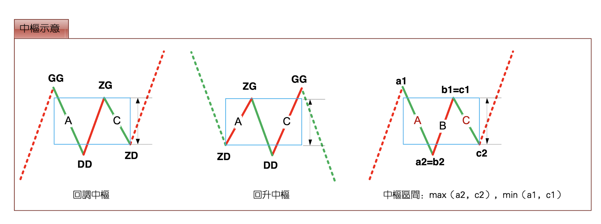
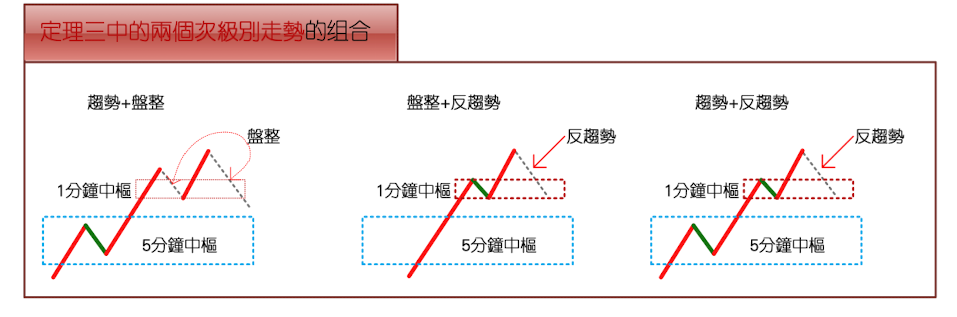
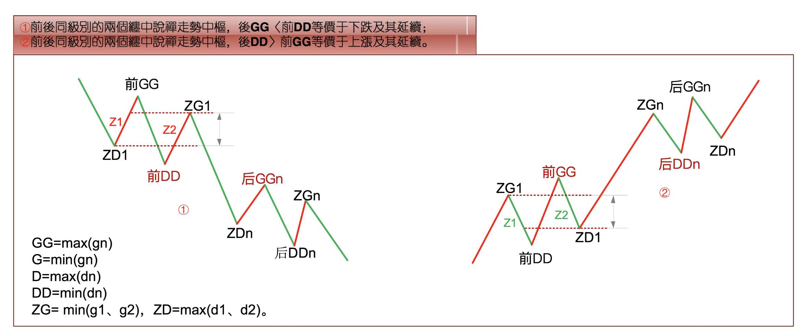
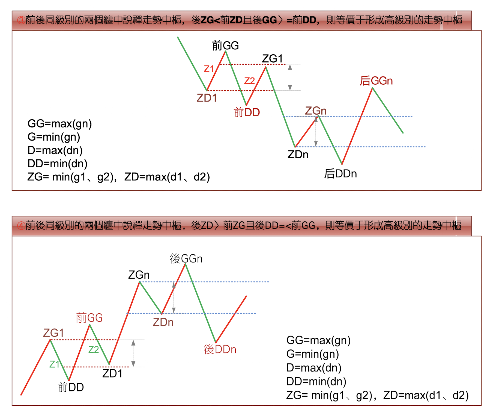

# 中枢

---

## 1. 中枢的定义 
某级别的走势类型，被“至少三个连续”“次级别走势类型“所重叠的部分，称为缠中说禅走势中枢。（ref. 《教你炒股票17 走势终完美》）
极限情况下：最后不能分解的级别，就不能用“至少三个连续次级别走势类型所重叠”定义，而定义为至少三个该级别单位 K 线重叠部分。

具体的计算以“前三个连续次级别”的重叠为准，严格的公式可以这样表示：  
- 次级别的连续三个走势类型A、B、C，分别的高、低点是 $$a_1/a_2$$,$$b_1/b_2$$,$$c_1/c_2$$。  
- 则中枢的区间就是 $$[(max(a_2,b_2,c_2), min(a_1,b_1,c_1))]$$。  
  而中枢的形成无非两种，一种是回升形成的，一种是回调形成的。对于第一种有$$a_1=b_1$$, $$b_2=c_2$$; 对第二种有$$a_2=b_2$$, $$b_1=c_1$$。但无论是哪种情况，中枢的公式都可以简化为 $$[max(a_2,c_2), min(a_1,c_1)]$$。  
  
  显然，A、C段，其方向与中枢形成的方向是一致的，由此可见，在中枢的形成与延伸中，由与中枢“形成方向”一致的次级别走势类型的区间重叠确定。  
  例如，回升形成的中枢，由向上的次级别走势类型的区间重叠确定，反之依然。  
  为方便起见，把这些与中枢方向一致的次级别走势类型称为`Z`走势段，按中枢中的时间顺序，分别记为$$Z_n$$等，而相应的高、低点分别记为$$g_n$$、$$d_n$$，定义四个指标，$$GG=max(g_n)$$, $$G=min(g_n)$$, $$D=max(d_n)$$, $$DD=min(d_n)$$，n 遍历中枢中所有$$Z_n$$。特别地，再定义$$ZG=min(g_1, g_2)$$，$$ZD=max(d_1,d_2)$$，显然，[ZD, ZG]就是缠中说禅走势中枢的区间。
  

## 2. 中枢的生命周期
- 延伸。
  中枢的前三个次级别走势之后，依然围绕中枢产生新的次级别走势，即是“中枢延伸”。并且所有围绕中枢产生的“出与进”两个次级波动都必须至少有一个触及走势中枢的区间，否则，就必然产生一个新的三次连续次级走势类型的重叠部分、离开原来的走势中枢。
- 扩张。扩张成更高级别的中枢。
  一个走势中枢完成前，其波动触及上一个走势中枢或延伸时的某个瞬间波动区间，这时就不能认为形成了趋势，而是产生了更大级别的走势中枢。
- 新生。生成新的同级别中枢。

**缠中说禅走势中枢定理一**：在趋势中，连接两个同级别“缠中说禅走势中枢”的必然是“次级别”或“次级别以下”级别的走势类型。

**缠中说禅走势中枢定理二**：在盘整中，无论是离开还是返回“缠中说禅走势中枢”的走势类型必然是次级别以下的。

**缠中说禅走势中枢定理三**：某级别“走势中枢”的破坏，当且仅当一个次级别走势离开该走势中枢后，其后的次级别回抽走势不重新回到该走势中枢内。
定理三中的两个次级别走势的组合只有三种：`趋势+盘整`，`趋势+反趋势`，`盘整+反趋势`。其中的趋势分为上涨与下跌，分别代表从上方突破与下方跌破两种情况。而站在实用的角度，最用力的破坏，就是：趋势+盘整。例如在上涨中，如果一个次级别走势向上突破后以一个盘整走势进行整理回抽，那其后的上涨往往比较有力，特别这种突破是在底部区间。  

注意：趋势+盘整组合中，盘整中的中枢级别必然高于趋势中的中枢级别，不然就会连接成一整个趋势。  

### 2.3 中枢扩张
**缠中说禅走势中枢中心定理一**：走势中枢的延伸等价于任意区间 $$[d_n，g_n]$$ 与 $$[ZD，ZG]$$ 有重叠。换言之，若有 $$Z_n$$，使得 $$d_n > ZG$$ 或 $$g_n < ZD$$，则必然产生高级别的走势中枢 或 趋势 或 趋势的延伸。

**缠中说禅走势中枢中心定理二**：
前后同级别的两个缠中说禅走势中枢，
- `后GG < 前DD` 等价于下跌及其延续；
- `后DD > 前GG` 等价于上涨及其延续；
- `后ZG < 前ZD` 且 `后GG >= 前DD` 等价于形成高级别的走势中枢；
- `后ZD > 前ZG` 且 `后DD =< 前GG` 等价于形成高级别的走势中枢。

