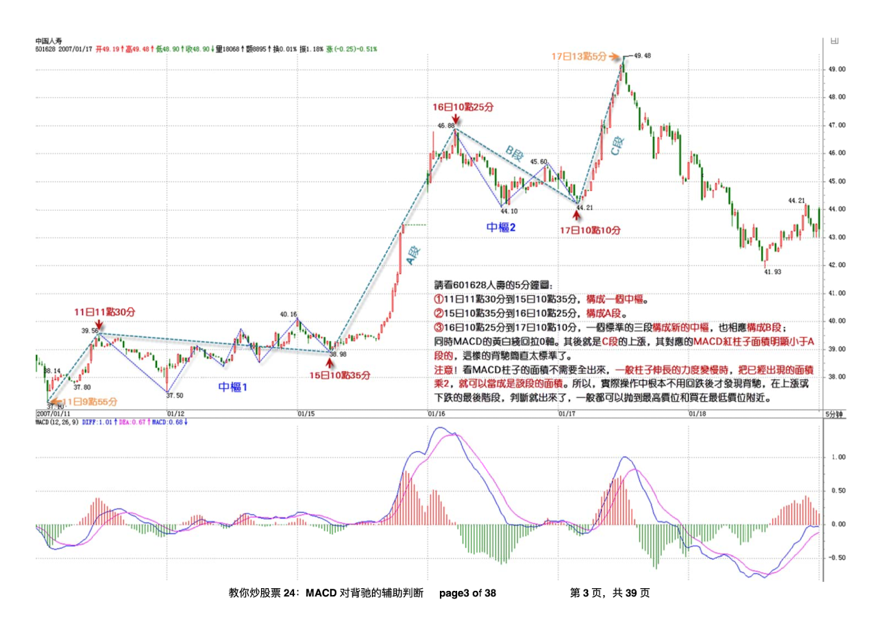
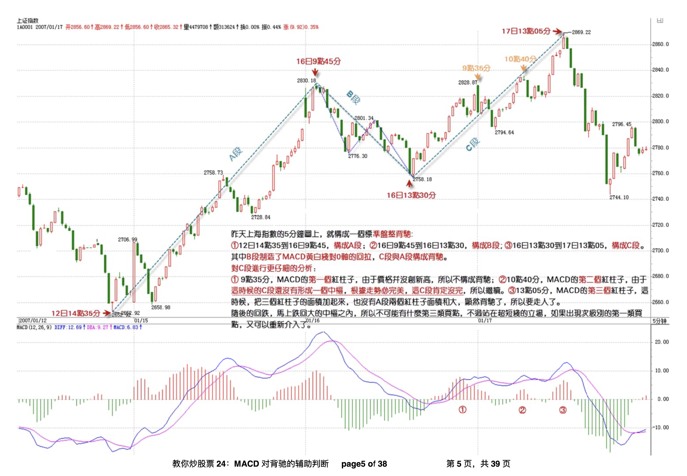
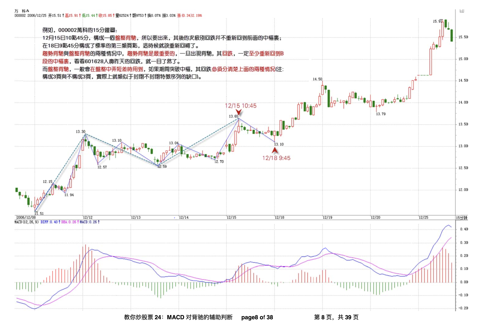
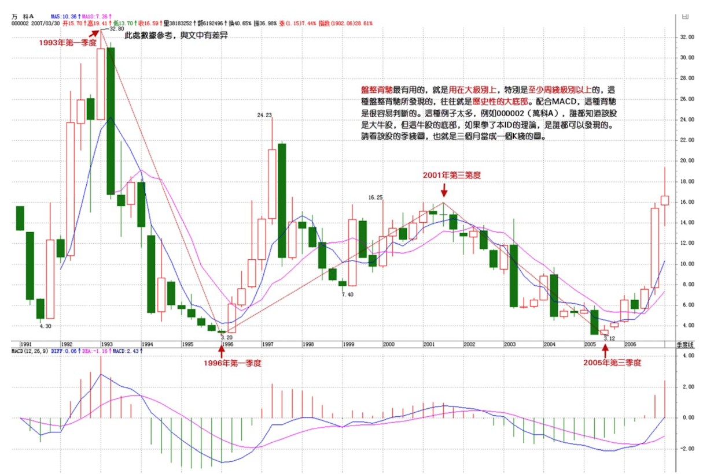
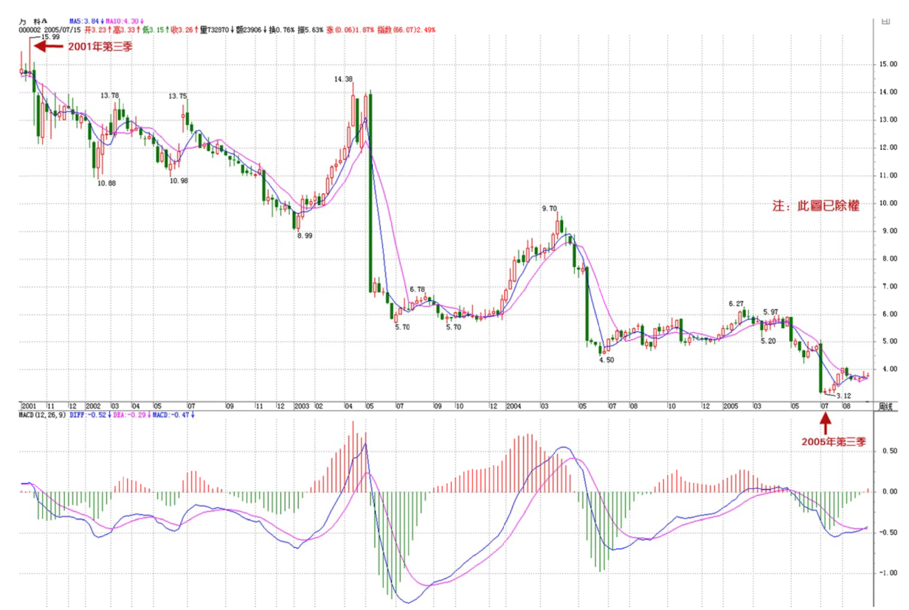
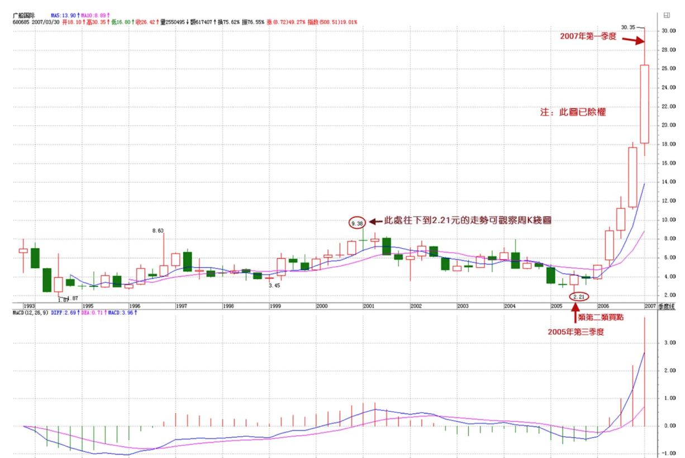
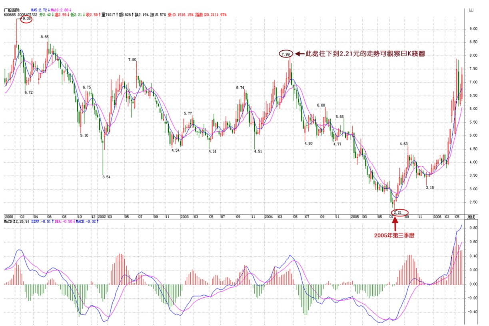
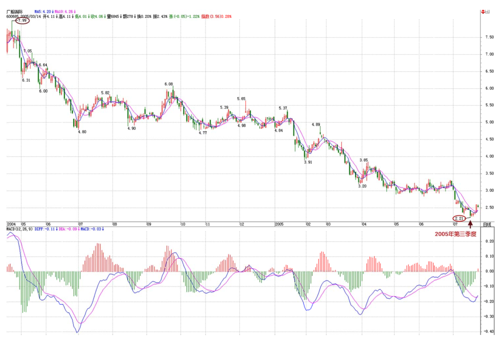
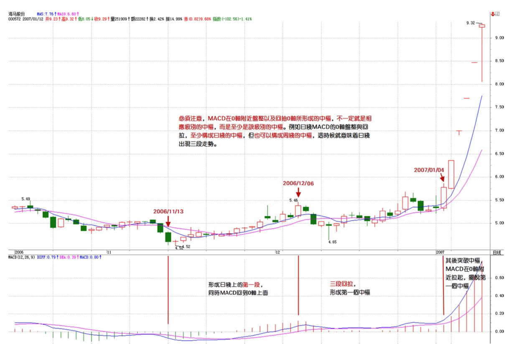

# 背驰

---

> 首先，背弛同样有级别的问题。
> 一个1分钟级别的背弛，在绝大多数的情况下，不会制造一个周线级别的大顶，除非日线上同时也出现背弛。但出现**背弛后必然有逆转**，这是没任何商量余地的。
> 有人要问，究竟逆转多少？那很简单，就是**重新出现新的次级别买卖点为止**。 

缠中说禅背驰-买卖点定理：任一背驰都必然制造某级别的买卖点，任一级别的买卖点都必然源自某级别走势的背驰。

## 2. 判断背驰
### 2.1 使用 MACD 辅助判断
前提：
- 首先要有两段同向的趋势。（注意，走势必完成原则）
- 同向趋势之间一定有一个盘整或反向趋势连接。
(ref. 《教你炒股票24 MACD对背弛的辅助判断》)  

### 2.2 以趋势背驰为例
趋势，一定有至少两个同级别中枢，对于背驰来说，肯定不会发生在第一个中枢之后，肯定是至少是第二个中枢之后。如果在第一个中枢就出现背驰，那不会是真正意义上的背驰，只能算是盘整背驰。  
多数的第二、三类买点，其实都是由盘整背驰构成的，而第一类买点，多数由趋势的背驰构成。  
> 把对比背驰的三段走势分别称为A、B、C段。显然，B的中枢级别比A、C里的中枢级别都要大，否则A、B、C就连成一个大的趋势或大的中枢了。  
> A段之前，一定是和B同级别或更大级别的一个中枢，而且不可能是一个和A逆向的趋势，否则这三段就会在一个大的中枢里了。  
归纳上述，用 MACD 判断趋势背驰的前提是，A、B、C段在一个大的趋势里，其中 A 之前已经有一个中枢，而 B 是这个大趋势的另一个中枢，B 中枢一般会把 MACD 的黄白线（也就是DIF和DEA）回拉到0 轴附近。而 C 段的走势类型完成时对应的MACD柱子面积（向上的看红柱子，向下看绿柱子）比A段对应的面积要小，这时候就构成标准的背弛。

换句话来说，C 段就是该级别趋势的背驰段，当出现背驰段后，通过区间套，不断向下查看次级别的走势，通过次级别走势的背驰来精确判断第一类买卖点。  
因此，判断趋势背驰的第一步是 —— 找到该级别的背驰段。  
反过来，对于小级别的背驰，是否会引发大的调整，则需要看大级别是否进入背驰段。  

### 2.3 盘整背驰
与趋势背驰不同，A、B、C 段同一级别且在一个盘整里。**C 段往往都破点 A 段的极限位置**，从而形成盘整背驰，注意，这里是 把A、C 段看成两个走势类型之间的比较，这和趋势背驰里的情况有点不同，这两个走势类型是否一定是趋势，都问题不大，两个盘整在盘整背驰中也是可以比较力度的。  
盘整背驰，其真正的技术含义，其实就是一个企图脱离中枢的运动，由于力度有限，被阻止而出现回到中枢里。  

盘整中往上的情况为例子（注意是盘整，不要把趋势最后一部分当成盘整来看）：  
- a. 不破中枢的盘整背驰  
    如果C段不破中枢，一旦出现 MACD 柱子的 C 段面积小于 A 段面积，其后必定有回跌。
- b. 破中枢的盘整背驰  
    如果 C 段上破中枢，但 MACD 柱子的面积小于 A 段的，这时候的原则是先出来，其后有两种情况：  
    1. 跌回中枢，继续盘整。
    2. 不跌回中枢，就在次级别的第一类买点回补，刚好这反而构成该级别的第三类买点。
注意，盘整背驰出来，并不一定都要大幅下跌，否则怎么会有第三类买点构成的情况。而趋势中产生的背驰，一定至少回跌到B段中，这就可以预先知道至少的跌幅。  

#### 使用盘整背驰判断历史性底部  
**背驰段定义**：在某级别的某类型走势，如果构成背驰或盘整背驰，就把这段走势类型称为某级别的。  
盘整背驰最有用的，就是用在大级别上，特别是至少周线级别以上的，这种盘整背驰所发现的，往往就是历史性的大底部。  
站在最大的级别看，所有股票都只有一个中枢，因此，站在大级别里，绝大多数的股票都其实是一个盘整，这时候就要用到由盘整背驰而形成的**类第一类买点**了。  

*MACD明显出现标准的背弛形态：回抽0轴的黄白线再次下跌不创新低，而且柱子的面积是明显小于 A 段的，一般来说，只要其中一个符合就可以是一个背弛的信号，两个都满足就更标准了。*    

**缠中说禅精确大转折点寻找程序定理**：某大级别的转折点，可以通过不同级别背驰段的逐级收缩范围而确定。  
换言之，某大级别的转折点，先找到其背驰段，然后在次级别图里，找出相应背驰段在次级别里的背驰段，将该过程反复进行下去，直到最低级别，相应的转折点就在该级别背驰段确定的范围内。  

类似的，在大级别里，如果不出现新低，但可以构成**类第二类买点**的，在 MACD 上，显示出类似背驰时的表现：黄白线回拉0轴上下，而后一柱子面积小于前一柱子的。（以下也展示了区间套手法）  

## 3. 背驰回跌的力度
对背驰的回跌力度，和级别很有关系：  
- 如果日线上在上涨的中段刚开始的时候，MACD刚创新高，红柱子伸长力度强劲，这时候5分钟即使出现背驰，其下跌力度显然有限，所以只能打点短差，甚至可以不管。
- 而在日线走势的最后阶段，特别是上涨的延伸阶段，一个1分钟的背驰足以引发暴跌，所以这一点必须多级别地综合来考察，绝对不能一看背驰就抛等跌50%，世界上哪里有这样的事情。

一般来说，一个标准的两个中枢的上涨，在MACD上会表现出这样的形态：
- 第一段，MACD的黄白线从0轴下面上穿上来，在0轴上方停留的同时，形成相应的第一个中枢，同时形成第二类买点，其后突破该中枢，MACD的黄白线也快速拉起，这往往是最有力度的一段，一切的走势延伸等等，以及MACD绕来绕去的所谓指标钝化都经常出现在这一段，这段一般在一个次级别的背驰中结束，然后进入第二个中枢的形成过程中；  
- 在第二个中枢的形成过程中，同时MACD的黄白线会逐步回到0轴附近；  
- 最后，开始继续突破第二个中枢，MACD的黄白线以及柱子都再次重复前面的过程，但这次，黄白线不能创新高，或者柱子的面积或者伸长的高度能不能突破新高，出现背驰，这就结束了这一个两个中枢的上涨过程。  

  
必须注意，MACD在0轴附近盘整以及回抽0轴所形成的中枢，不一定就是相应级别的中枢，而是至少是该级别的中枢。例如日线MACD的0轴盘整与回拉，至少构成日线的中枢，但也可以构成周线的中枢，这时候就意味着日线出现三段走势。  

## 4. 转折
在某级别的盘整中，或者说围绕某级别中枢的震荡、延续中，不存在转折的问题，除非站在次级别图形中，才有转折问题的探讨。
- 对于上涨的转折，有两种：下跌和盘整；
- 对于下跌的转折：上涨和盘整；

**缠中说禅背驰-转折定理**：某级别趋势的背驰将导致三种分类：1. 该趋势最后一个中枢的级别扩展；2. 该级别更大级别的盘整；3. 该级别以上级别的反趋势。  

### 4.1 该趋势最后一个中枢的级别扩展  
触及最后一个中枢的 $$DD=min(d_n)$$ 的反弹，就是背弛后最弱的反弹，这种反弹，将把最后一个中枢变成一个级别上的扩展，例如，把5分钟的中枢扩展成30分钟甚至更大的中枢。  

注意，这种情况和“盘整背驰中转化成第三类卖点”的情况不同：
- 后者，反弹的级别一定比最后一个中枢低；
- 前者，反弹的级别一定等于或大于最后一个中枢的；（因为中枢至少是被扩展的状态）
因此，这两种情况，不难区分。  

后面二种情况就是发生转折的两种情况，原理是一样的，只是相应的力度有区别。  
当反弹至少要重新触及最后一个中枢（触及`ZD`），这样，将发生转折，也就是出现盘整与上涨两种情况。  
### 4.2 该级别更大级别的盘整  

