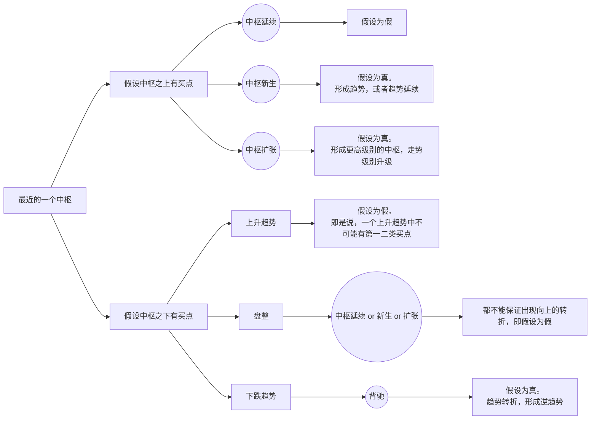

# 买卖点

---
## 1. 三类买卖点定义

### 第一二类买卖点
根据“走势终完美”和走势分解定理，就可以推出：
- 因为某种类型的走势完成以后就会转化为其他类型的走势，对于下跌的走势来说，一旦完成，只能转化为上涨与盘整，因此，一旦能把握下跌走势转化的关节点买入，就在市场中占据了一个最有利的位置，而这个买点，就是前面反复强调的“第一类买点”；  
而因为无论是趋势还是盘整在图形上最终都要完成，所以在第一类买点出现后“第一次”、“次级别回调”制造的低点，是市场中第二有利的位置，即“第二类买点”。  
- 卖点的情况，对于上涨的走势，一旦走势完整，只会转化为下跌与盘整，这个转化的节点，就是“第一类卖点”。
而第一卖点后的“第一次”“次级别反抽”制造的高点，就是“第二类卖点”。

**缠中说禅买卖点定律一**：任何级别的第二类买卖点都由次级别相应走势的第一类买点构成。  
**缠中说禅趋势转折定律**：任何级别的上涨转折都是由某级别的第一类卖点构成的；任何的下跌转折都是由某级别的第一类买点构成的。  

### 第三类买卖点
根据走势中枢中心定理一，可以推出**缠中说禅第三类买卖点定理**：
- 在某级别向上的趋势中，一个次级别走势类型向上离开最近的一个走势中枢，然后以一个次级别走势类型回试，其低点不跌破 ZG，则构成第三类买点；  
- 在某级别向下的趋势中，一个次级别走势类型向下离开最近的一个走势中枢，然后以一个次级别走势类型回抽，其高点不升破 ZD，则构成第三类卖点；  
- 并不是任何回调回抽都是第三类买卖点，必须是“第一次”。  
- 第三买卖点，就是次次级别的第一买卖点。（比如日线级别的第三买卖点，需要看30分钟级别的回抽，而30分钟级别的回抽的完成又需要看3段5分钟级别走势的完成。）
第三类买卖点后，并不必然是趋势，也有进入更大级别盘整的可能（特别是回踩不跌破 ZG，但却直接跌破 GG，这时已经可以明确出现中枢扩张、产生更高级别的中枢），但这种买卖之所以必然赢利，就是因为即使是盘整，也会有高点出现。操作策略很简单，一旦不能出现趋势，一定要在盘整的高点出掉，这和第二类买点的策略是一样的。  

## 2. 查找买卖点
**缠中说禅背驰-买卖点定理**：任一背驰都必然制造某级别的买卖点，任一级别的买卖点都必然源自某级别走势的背驰。  

换句话说，只要你看到某级别的背驰，必然意味着要有逆转。  
有人要问，究竟逆转多少？那很简单，就是重新出现新的次级别买卖点为止。  

第一、二类买点：
1. 首先，必须在某级别的下跌趋势中寻找。即必须至少有两个以上的本级别中枢之后，才会有第一买点，否则不存在第一买点。  
2. 在次级别走势离开最后一个本级别中枢，如果形成趋势背驰，背驰点即为本级别的第一类买点。  
3. 形成背驰点后，必定会向本级别的最后一个中枢的方向进行次级别回拉，根据走势必完美原则，回拉后会有一次与回拉反方向的次级别调整，只要这次调整不跌破之前第一类买点的位置（三段次次级别走势完成，即次级别完成、形成次级别的第一类买点，这时未跌破），即是本级别的第二类买点。
4. 第二类买点后，至少仍有一次次级别向上 ———— 无论是转折后形成上涨还是进行盘整。

第三类买点：

**所有买卖点都必然对应着与该级别最靠近的一个中枢的关系**：
- 对于买点来说，该中枢之下产生的必然对应着转折（第一买点），中枢之上产生的必然对应着延续（第三买点）。  
- 对于卖点来说，该中枢之上产生的必然对应着转折（第一卖点），中枢之下产生的必然对应着延续（第三卖点）。  
  

